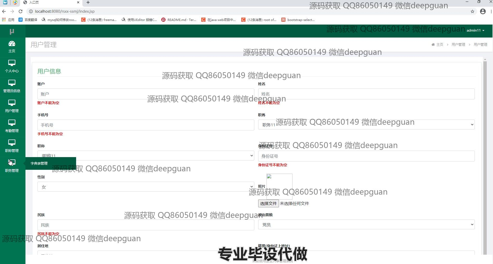
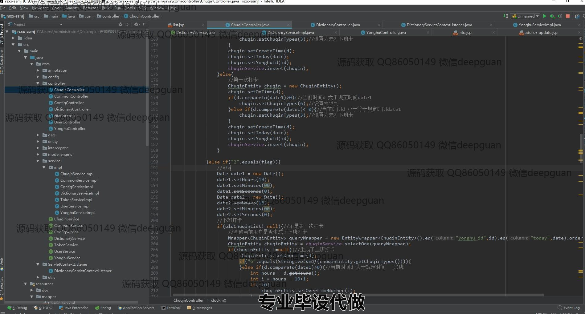

<h1 align="center">单位人事管理系统</h1>

## 简介
单位人事管理系统：角色分为管理员、用户；功能包括员工信息管理、用户管理、考勤管理、薪资管理、职务管理、职位管理，并支持数据的增删改查和条件筛选查询。    --计算机毕业设计源码；毕设源码；java毕业设计源码

## 联系方式

<h3 align="center">获取完整代码与数据库文件 + 微信：deepguan QQ: 86050149 QQ群: 783742310</h3>

<h3 align="center">可帮忙远程部署 包运行成功！提供远程部署、修改代码、设计文档指导、代码讲解等服务！</h3>

## 功能介绍（完整见运行截图）
管理员： 基本功能：登录，管理用户账号，管理考勤记录，职务管理，员工信息查看与修改。 网站首页：主导航栏，用户管理，考勤管理，职务管理，薪资管理。 用户信息：查看和编辑员工的基本信息，如姓名、手机号、职位、职务、身份证号、性别、民族、政治面貌、婚姻状况等。 用户管理：管理员可以新增、删除、修改用户信息，支持批量操作和条件筛选。 考勤管理：查看员工的上下班打卡记录，支持筛选、删除和查看详细考勤信息。 职务管理：新增或编辑员工职务信息，帮助管理员高效管理职务信息。 

员工： 基本功能：登录，查看个人信息，更新联系方式，查看考勤记录。 个人信息：查看和修改自己的基本信息，如姓名、职位、联系方式、性别等。 考勤管理：查看自己的打卡记录，了解上下班打卡时间、迟到、早退等情况。 其它功能：查询和编辑个人信息，保持个人资料的更新，获取相关考勤与薪资数据。

系统： 基本功能：用户身份管理，信息录入与查询，数据存储。 系统架构：采用SSM框架，数据库管理用户信息，考勤记录及职务数据。 功能模块：用户管理，考勤管理，职务管理，数据增删改查操作，确保信息的有效更新与管理。 用户数据：管理用户账号、密码、角色信息，提供添加、删除、修改功能。

## 运行截图

本代码来源于网络,仅供学习参考使用!

